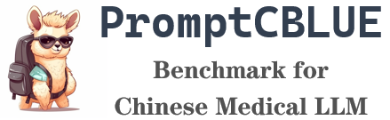

[**中文**](./README.md) | [**English**](./README_EN.md) 

     
    
     

    
    

The emergence of large language models (LLMs) represented by ChatGPT and GPT-4 has sparked a new wave of research in the field of natural language processing, demonstrating capabilities similar to those of general artificial intelligence (AGI) and attracting widespread attention from the industry. With the prevalence of LLMs, almost all NLP tasks have been transformed into prompt-based language generation tasks. However, in the Chinese medical NLP community, there is still no unified task-based benchmark for evaluation.

To promote the developments and applications of LLMs in the medical field, Professor Xiaoling Wang's team from East China Normal University, in collaboration with Alibaba Tianchi Platform, Fudan University, Huashan Hospital affiliated to Fudan University, Northeastern University, Harbin Institute of Technology (Shenzhen), Peng Cheng Laboratory, and Tongji University, has launched the **PromptCBLUE** evaluation benchmark by modifying the [CBLUE](https://tianchi.aliyun.com/dataset/95414) benchmark. This benchmark has converted all 16 different medical NLP tasks into prompt-based language generation tasks, creating the first Chinese medical LLM evaluation benchmark. PromptCBLUE is one of the evaluation tasks for the [CCKS-2023](https://sigkg.cn/ccks2023/evaluation) conference and has been launched for open evaluation on the Alibaba Tianchi competition platform. Industrial practitioners, students and researchers are welcome to register and participate in the competition.

In consideration of the potential involvement of commercial data in LLM training and the limitations posed by various external factors on the open-sourcing of large language models, we have opened two tracks for the PromptCBLUE evaluation:
- General track: This track accepts evaluations from enterprises, universities, open-source communities, research teams, or individuals who have developed their own LLMs. Participants are not required to open-source their models. The evaluation website for this track is available at [CCKS2023-PromptCBLUE General Track](https://tianchi.aliyun.com/competition/entrance/532085/introduction).
- Open-source track: This track is open to all participating teams who must use an open-source large-scale model framework and only train/fine-tune using open-source datasets or datasets that can be submitted to the competition organizer for review. The evaluation website for this track is available at [CCKS2023-PromptCBLUE Open-source Track](https://tianchi.aliyun.com/competition/entrance/532084/introduction).

To assist in the enhancement of LLM's abilities in the medical field, we are open-sourcing the following data/model resources:
- 🚀 [ChatMed_Consult_Dataset](https://huggingface.co/datasets/michaelwzhu/ChatMed_Consult_Dataset)：A Chinese medical online consultation dataset containing 500k+ online consultation queries and responses made by ChatGPT.
- 🚀 [ChatMed-Consult model](https://huggingface.co/michaelwzhu/ChatMed-Consult): A large Chinese medical consultation model fine-tuned on [ChatMed_Consult_Dataset](https://huggingface.co/datasets/michaelwzhu/ChatMed_Consult_Dataset). The model is based on the [LlaMA-7b](https://github.com/facebookresearch/llama) merged with LoRA weights from [Chinese-LlaMA-Alpaca](https://github.com/ymcui/Chinese-LLaMA-Alpaca). All data and code are publicly available at [ChatMed项目](https://github.com/michael-wzhu/ChatMed).
- ⏳ [ChatMed_TCM_Dataset](https://huggingface.co/datasets/michaelwzhu/ChatMed_TCM_Dataset). A dataset of instructions for traditional Chinese medicine (TCM) with 26k+ samples generated using the [entity-centric self-instruct method](https://github.com/michael-wzhu/ChatMed/blob/main/src/) based on our open-sourced [TCM knowledge graph](https://github.com/ywjawmw/TCM_KG) and ChatGPT responses.
- ⏳ [ChatMed-TCM model](https://huggingface.co/michaelwzhu/ChatMed-TCM) : Empowering TCM inheritance with LLMs. This model is also based on LlaMA and fine-tuned on the [ChatMed_TCM_Dataset](https://huggingface.co/datasets/michaelwzhu/ChatMed_TCM_Dataset) with LoRA.

----

[Text2DT](https://github.com/michael-wzhu/Text2DT_Baseline) | [ChatMed_Consult_Dataset](https://huggingface.co/datasets/michaelwzhu/ChatMed_Consult_Dataset) | [ChatMed-Consult model](https://huggingface.co/michaelwzhu/ChatMed-Consult) | [ChatMed_TCM_Dataset](https://huggingface.co/datasets/michaelwzhu/ChatMed_TCM_Dataset) |  [ChatMed-TCM model](https://huggingface.co/michaelwzhu/ChatMed-TCM) 

## Updates

2023/05/12 English README is out!